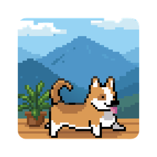

# CorgiBreak

<p align="center">
  
</p>

<p align="center">
  A macOS menu bar app that helps protect your eyes using the <b>20-20-20 rule</b> — every 20 minutes, look at something 20 feet away for 20 seconds.<br>
  With an adorable animated pixel corgi to keep you company during breaks.
</p>

<p align="center">
  
</p>

## Features

- **20-20-20 Timer** — Automatically reminds you to take a break every 20 minutes
- **Fullscreen Overlay** — A blurred overlay with a countdown timer appears across all screens
- **Animated Pixel Corgi** — 8 unique corgi animations (idle, walk, run, sit, jump, sniff, and more) randomly chosen each break
- **Menu Bar Only** — Lives in the menu bar, stays out of your way
- **Launch at Login** — Optional toggle to start with macOS
- **Pause / Resume** — Pause the timer when you don't need it
- **Skip Breaks** — Press `Esc` or click Skip to dismiss a break early
- **Multi-Monitor** — Overlay appears on all connected displays
- **Zero Dependencies** — Pure Swift and SwiftUI, no third-party libraries

## Requirements

- macOS 14.0 (Sonoma) or later

## Installation

### Homebrew (recommended)

```bash
brew install --cask VolodymyrM27/corgibreak/corgibreak
```

After installing, remove the quarantine attribute (required because the app is not notarized with Apple):

```bash
xattr -d com.apple.quarantine /Applications/CorgiBreak.app
```

> **Note:** This is standard for open-source macOS apps distributed outside the App Store.

### Manual Download

1. Download `CorgiBreak.zip` from the [Releases](https://github.com/VolodymyrM27/CorgiBreak/releases) page
2. Unzip and drag **CorgiBreak.app** to your Applications folder
3. If macOS shows "app cannot be opened", run:

```bash
xattr -d com.apple.quarantine /Applications/CorgiBreak.app
```

### Build from Source

Requires Xcode 15.0+ and [XcodeGen](https://github.com/yonaskolb/XcodeGen).

```bash
git clone https://github.com/VolodymyrM27/CorgiBreak.git
cd CorgiBreak
brew install xcodegen
xcodegen generate
xcodebuild \
  -project CorgiBreak.xcodeproj \
  -scheme CorgiBreak \
  -configuration Release \
  -derivedDataPath build \
  build
open build/Build/Products/Release/CorgiBreak.app
```

## Usage

1. Launch **CorgiBreak** — it appears as an eye icon in the menu bar
2. The timer counts down from 20:00
3. When the timer hits zero, a fullscreen break overlay appears with your pixel corgi
4. Look at something 20 feet away for 20 seconds
5. The overlay dismisses automatically, or press **Esc** to skip

### Menu Bar Options

| Action           | Shortcut |
| ---------------- | -------- |
| Pause / Resume   | `P`      |
| Take a Break Now | `B`      |
| Quit             | `Q`      |

## Project Structure

```
CorgiBreak/
├── Sources/
│   ├── CorgiBreakApp.swift      # App entry point, menu bar setup
│   ├── MenuBarView.swift        # Menu bar dropdown UI
│   ├── TimerManager.swift       # 20-20-20 timer logic
│   ├── OverlayManager.swift     # Fullscreen window management
│   ├── BreakView.swift          # Break overlay UI
│   ├── PixelCorgi.swift         # Animated sprite rendering
│   └── VisualEffectView.swift   # NSVisualEffectView wrapper
├── Resources/
│   ├── CorgiFrames/             # Pre-extracted animation frames
│   ├── Assets.xcassets/         # App icon and assets
│   └── Info.plist
├── scripts/
│   └── extract_frames.py        # Sprite sheet extraction tool
├── project.yml                  # XcodeGen project definition
└── CLAUDE.md                    # AI assistant instructions
```

## Tech Stack

- **Swift 5.9** / **SwiftUI**
- **AppKit** for window management and visual effects
- **XcodeGen** for project file generation
- No third-party dependencies

## Roadmap

- [ ] Customizable break interval and duration
- [ ] Preferences UI (settings window)
- [ ] Do Not Disturb / Focus mode detection — skip breaks during meetings or presentations
- [ ] Option to disable sound effects
- [ ] Gentle notification mode as an alternative to fullscreen overlay
- [ ] Break statistics — track breaks taken today/this week, streaks
- [ ] Auto-updates via Sparkle
- [ ] Accessibility improvements — VoiceOver labels, reduce motion support
- [ ] Localization (English, Ukrainian)

Have a feature idea? [Open an issue](https://github.com/VolodymyrM27/CorgiBreak/issues) — contributions are welcome!

## License

This project is licensed under the MIT License — see the [LICENSE](LICENSE) file for details.
